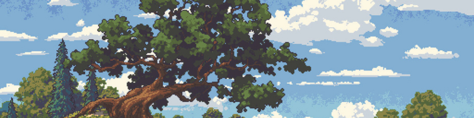

 

# Evandio de Souza
Acadêmico de ADS | Construindo uma base sólida em engenharia de software e arquitetura de sistemas.

 

## Tecnologias e Ferramentas

<table>
  <tr>
    <td valign="top" width="50%">
      <b>Foco Atual (Estudos e Faculdade)</b> 
      <i>Consolidando lógica, bancos de dados e consumo de APIs através do desenvolvimento prático em projetos pessoais.</i>  
       <b>Figma</b> (UI/UX)  
       <b>HTML5</b> &nbsp;&nbsp;  <b>CSS3</b> &nbsp;&nbsp;  <b>JavaScript</b>  
       <b>PHP</b> &nbsp;&nbsp;  <b>Python</b>  
       <b>PostgreSQL</b>  
       <b>Tailwind CSS</b> &nbsp;&nbsp;  <b>Vue.js</b>
    </td>
    <td valign="middle" align="center" width="50%">
      
    </td>
  </tr>
</table>
 

## Contato

&nbsp;&nbsp;&nbsp;&nbsp;
&nbsp;&nbsp;&nbsp;&nbsp;

 

> O Bulbasaur no topo representa o meu estágio atual na programação. Conforme eu for adquirindo novas habilidades, subindo de nível na graduação e entregando projetos mais complexos, ele também evoluirá por aqui.
>
> Banner adaptado da arte de [Philipp A. Urlich](https://www.artstation.com/artwork/6L2AG6)
